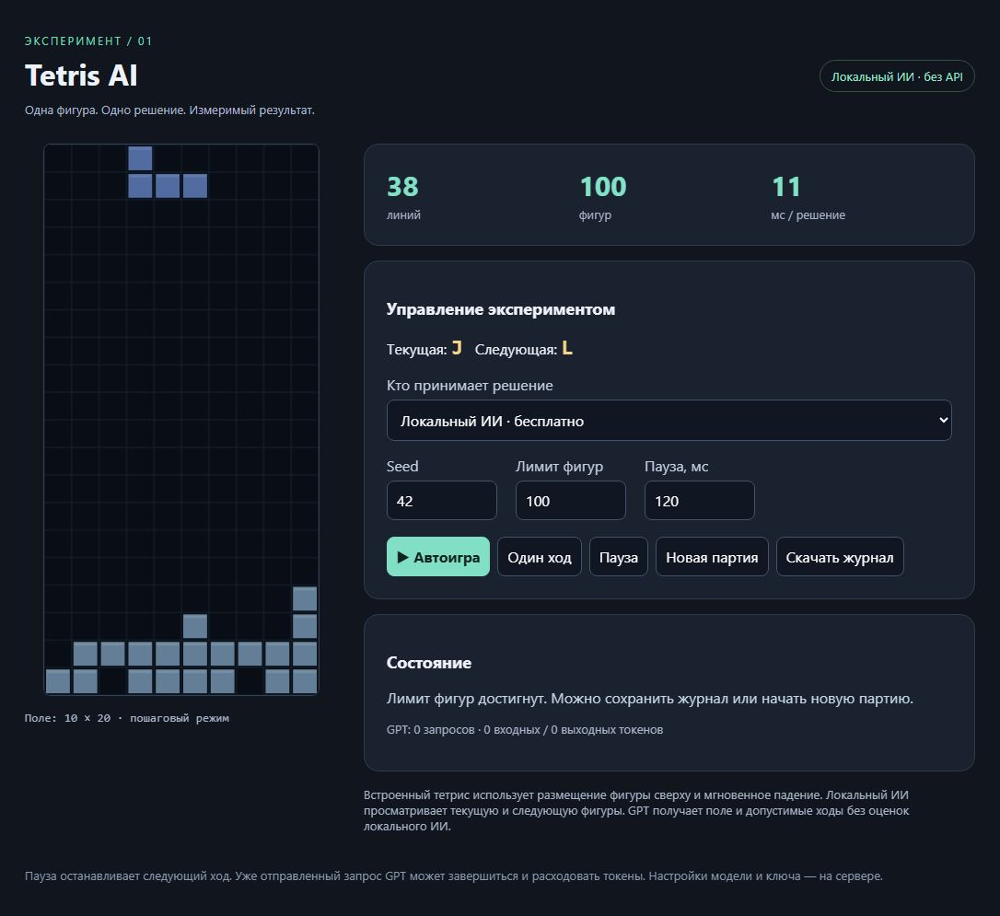

# Tetris AI

Эксперимент с игровым ИИ: локальный алгоритм, опциональный GPT и расширение
Chrome/Edge для игры на **online-tetris.ru**. Есть встроенный пошаговый тетрис
для воспроизводимых испытаний.



## Возможности

- Бесплатный локальный алгоритм с просмотром текущей и следующей фигур.
- GPT через OpenAI API в Solo и встроенной лаборатории; один запрос на фигуру.
- Расширение для Solo, PvP Classic и PvP Season на online-tetris.ru.
- Задержка между фигурами от 0 до 2000 мс, остановка кнопкой или Esc.
- Проверка фактического результата каждого хода и журналы эксперимента.

**Локальный алгоритм не является GPT.** Он перебирает размещения и оценивает
высоту столбцов, дыры и неровность поверхности. В режиме GPT решения принимает
модель, без скрытого переключения на локальный алгоритм при ошибке.

## Требования

- Python **3.10+**. Дополнительные Python-пакеты не требуются.
- Chrome или Edge для расширения.
- Node.js нужен только для тестов расширения, не для обычной игры.
- Для локального ИИ API-ключ и подписка не нужны.

## Быстрый запуск на Windows

1. Скачай проект через **Code → Download ZIP** и распакуй его.
2. Установи Python 3.10+, если он ещё не установлен.
3. Запусти **start-online.bat**. Откроется страница подключения.
4. Открой `chrome://extensions` или `edge://extensions`, включи режим разработчика
   и нажми **Загрузить распакованное расширение**.
5. Выбери папку **online-extension**, в которой находится `manifest.json`.
6. В настройках расширения вставь полный адрес со страницы подключения,
   выбери локальный ИИ, разреши запросы к серверу и сохрани настройки.
7. Открой сайт, начни игру, затем нажми **Старт ИИ** на панели.

`start-online.bat` запускает сервер в фоне. После перезапуска сервера адрес
и токен могут измениться: обнови их в настройках расширения. Текущий адрес и PID
сохраняются в `logs/connection.json` — этот файл не предназначен для публикации.

Для запуска с видимой консолью и остановкой через Ctrl+C:

```sh
python server.py --online --port 0
```

Для встроенного тетриса запусти **start.bat** или `python server.py`.
На macOS/Linux запускай Python-команду из терминала вместо BAT-файла.

## Настройка GPT

Задай `OPENAI_API_KEY` в окружении процесса и укажи доступную твоему API-аккаунту
модель с поддержкой Responses API и Structured Outputs:

```sh
python server.py --online --port 0 --model YOUR_MODEL_ID --max-requests 100
```

Запросы API могут быть платными. Ключ хранится в окружении сервера и не передаётся
расширению. Ограничение `--max-requests` действует на попытки за запуск сервера,
включая неудачные. Новая партия его не сбрасывает; автоматических повторов нет.
Ответ ограничен 1024 токенами: некоторым моделям этого может не хватить.

В PvP доступен только локальный ИИ. В Solo игра ставится на паузу на время решения.
В PvP матч продолжается при остановке бота, скрытии вкладки или достижении лимита:
после остановки управление возвращается игроку.

## Как устроено

| Файл | Назначение |
| --- | --- |
| `engine.py` | Геометрия, допустимые размещения и локальная оценка |
| `server.py` | Локальный HTTP API, GPT, журналы |
| `index.html` | Встроенная лаборатория |
| `online-extension/` | Адаптер сайта и управление |
| `adapter.py` | Контракт адаптера для других игр |
| `ONLINE-TETRIS.md` | Обновление расширения и ограничения |

Сервер слушает только `127.0.0.1`, запросы решений требуют случайный токен сессии.
Расширение читает состояние движка сайта и отправляет клавиатурные события.
Оно не распознаёт экран и не подключается автоматически к произвольному тетрису.
Интеграция зависит от структуры JavaScript сайта (webpack-модуль 933).

Алгоритм поддерживает прямые падения семи стандартных фигур. Нет стратегии hold,
сложных перемещений под навесами и гарантии оптимальной игры. Ползунок задаёт
дополнительное ожидание между фигурами, а не замедляет гравитацию сайта.
Перемещения и повороты одной фигуры выполняются быстро.

## Проверки

```sh
python -m unittest -v
node test-extension.cjs
```

Тесты не делают платных запросов. Они проверяют геометрию, очистку строк,
локальный API, обработку GPT-ответов на заглушках и отдельные свойства расширения.
Они не заменяют проверку живого сайта. Пользователь сообщил об успешной игре
в PvP; широкая совместимость и устойчивость в разных матчах не подтверждены.

## Если что-то не работает

- **Failed to fetch:** проверь, что сервер запущен, а в расширении сохранён
  его текущий адрес; включи разрешение на запросы в настройках расширения.
- **Solo не запускается без расширения:** проверь ошибки консоли сайта.
  Ошибка `io is not defined` означает, что не загрузилась его библиотека socket.io.
- **Панель не появилась:** обнови расширение и вкладку сайта; проверь маршрут.
- **Поле отличается от ожидаемого:** сохрани журнал для диагностики;
  бот останавливается, чтобы не выполнять дальнейшие неверные команды.

Проект независим от online-tetris.ru и OpenAI. Исходный код самого сайта,
пользовательские журналы, API-ключи и локальные токены в репозиторий не включены.
